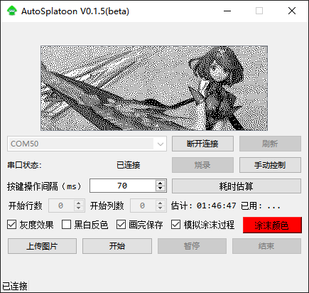

<!--
 * @Author: wudy
 * @Date: 2022-11-21 12:02:49
 * @LastEditTime: 2022-11-23 15:37:11
 * @LastEditors: wudy
 * @Description: 
 *  
-->
# AutoSplatoon

基于[ClubchatGames](https://github.com/nullstalgia/ClubchatGames)

---
**软件界面：**

---
**实机效果**

---
**支持硬件：**

ESP32系列，e.g. ESP32 WROOM模组、ESP32 WROVER模组、ESP32 PICO V3芯片、ESP32 PICO D4芯片...

---
**使用教程：**

详见B站[【斯普拉遁】广场涂鸦自动化工具！保姆级教程](https://www.bilibili.com/video/BV1va411R7TJ?vd_source=08b359f4e68b47a7ff089bcfa5caa191)

---
**TODO**

- [x] 支持用户自定义绘图速度
- [x] 内置图像灰度处理，无需使用Photoshop事先处理
- [x] 根据画面黑白像素个数优化绘图速度
- [x] 支持从指定位置开始绘图,需要同主机端的画笔位置相同,有点不好操作
  [ ] 现在画点的方式是有一个黑点就移动到此处涂一个点。看了优伊控（功能很强）是按住A键移动光标，这样会节省不少时间。

更新过程：

---
VER 0.1.6
1.增加了把当前的界面保存为320x120图片的功能,如果需要后期修改(添加文字之类的比较方便).
2.最天晚上在电视上用工具涂了一次，发现我之前的算法有点问题（向右涂的时候最后一格没有涂到,SWITCH屏太小，之前没注意到这个问题)。这个版本修复了这个问题.

---
VER 0.1.5
重要更新！现在只需要把你喜欢的图片打开，移动到你觉得好看的位置就可以了。基本上所见既所得。
1.不限制图片格式，不限制图片大小；
2，图片可以移动，缩放；
3，可以自动自动把图片模拟成灰度效果（本次更新中最重要的功能）；
4,现在可以直接看到反色后的效果

---
VER 0.1.4
1.增加了软件版本显示,直接修改version.h
2.修复0.1.3时间估算不准确的问题

---
VER 0.1.3
1.增加了黑白反色的功能,使用后黑白色会互换;最终生成的效果会相反。根据内容的不同，画图的时间会受影响；
2.模拟画点的过程,需要画点的地方会显示出来,颜色可以设置；只影响PC上的显示效果，不影响实际输出；
3.增加了耗时估算的功能，每次上传文件或者修改开始位置后会自动估算耗时；
4.简单优化了画图算法，图像两边有较多空白时能较大的减小画图的时间。尝试一下反色也许可以节约一些时间；
5.增加了画图结束后保存的功能（在 jiangotto的项目上看到的用户请求，我手里没有SWITCH lite,不知道是不是按键不一样。普通SWITCH上是“-”按键；

